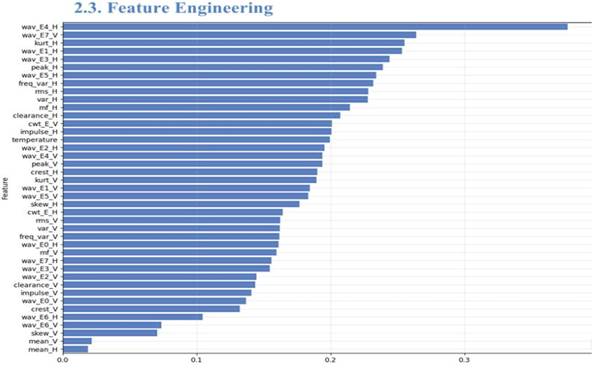
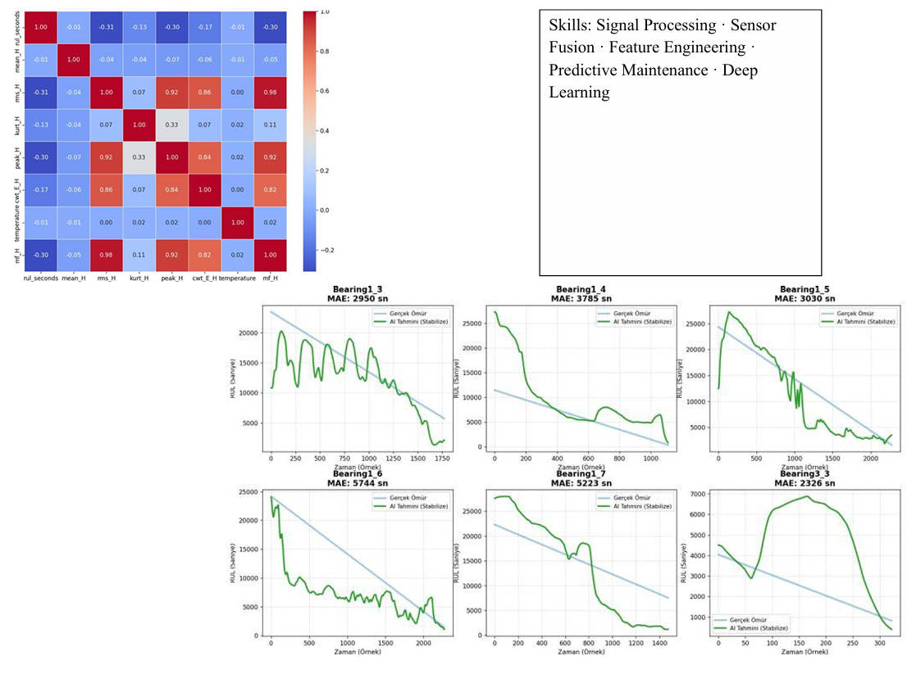
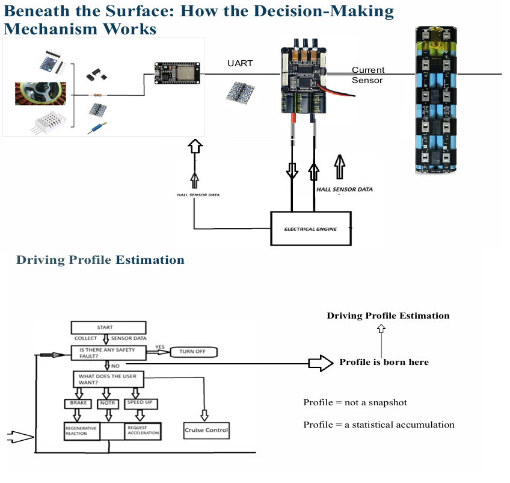
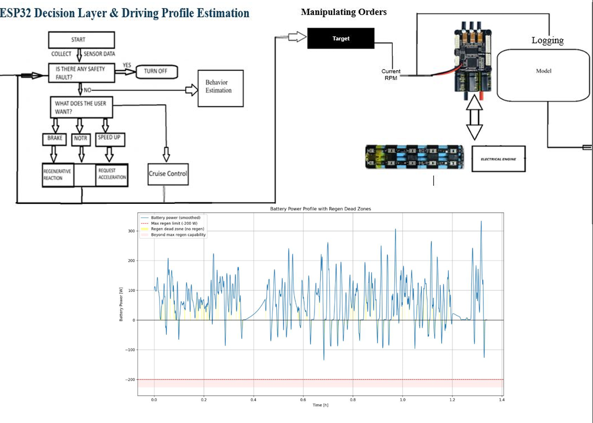
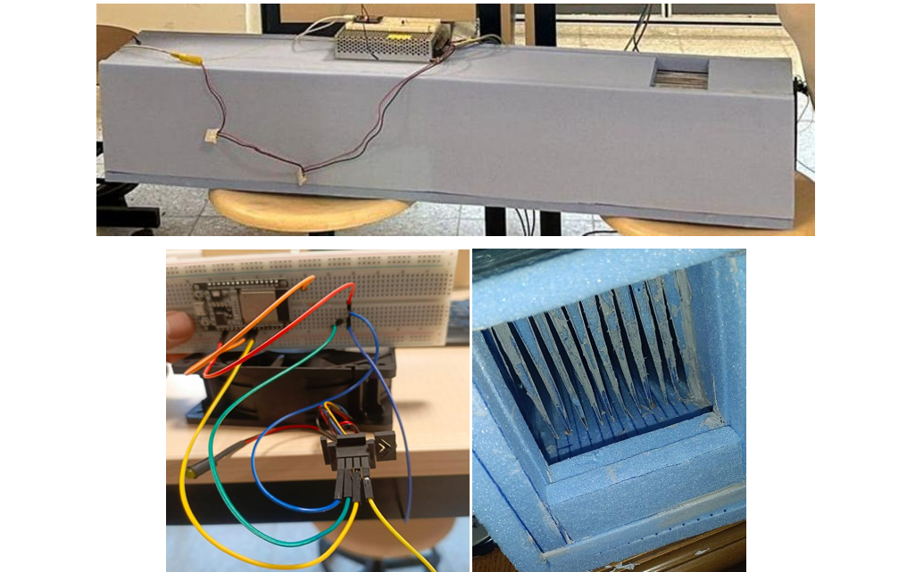

<a href="CV.pdf" class="btn btn-primary" target="_blank">Download my CV (PDF)</a>

# Education

-   B.S., Mechanical Engineering, Hacettepe University, Turkey, 2021 - ongoing.

# Work Experience

## Employement

1.  Hacettepe University , position Research Support Assistant, year 2025 September - 2026 July

## Internships

1.  Baibars Mechatronics Inc. , position Intern, July 2024

2.  ZTR defence Industry Inc. , position Intern, July 2025

# Projects

**AI & Predictive Maintenance Project**

Developing a Hybrid LSTM AI model to predict machine health (RUL) by
analyzing vibration signatures. Implementing sensor fusion techniques for
industrial bearing fault detection.(non-linear system)

**Smart E-Bike Kit Design**

Designing a friction-drive E-Bike conversion kit with an ESP32-based
control algorithm. Developing a Digital Twin simulation in
MATLAB/Simulink to analyze real-time telemetry.

{width="595"}

**Smart Forced-Air Intake & Heating Control System**

Designed and built an electronic control unit for a custom fresh air heating system. The project aims to heat cold outdoor air and introduce it indoors without mixing with internal air, requiring high-static pressure airflow management.

# Competencies

R · Git · Quarto · Python · Signal Processing · Sensor Fusion · Feature Engineering · Predictive Maintenance · Deep Learning · Electronics Prototyping · Strategic Planning · Digital Twin · Python · VESC · Production Strategy

# Hobbies

Music · Rhythmic Poetry · Piano · Saz · Nature Walk
